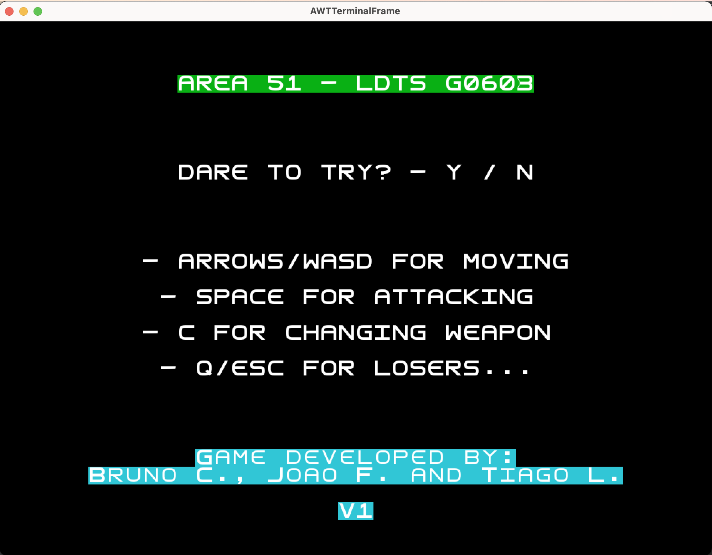
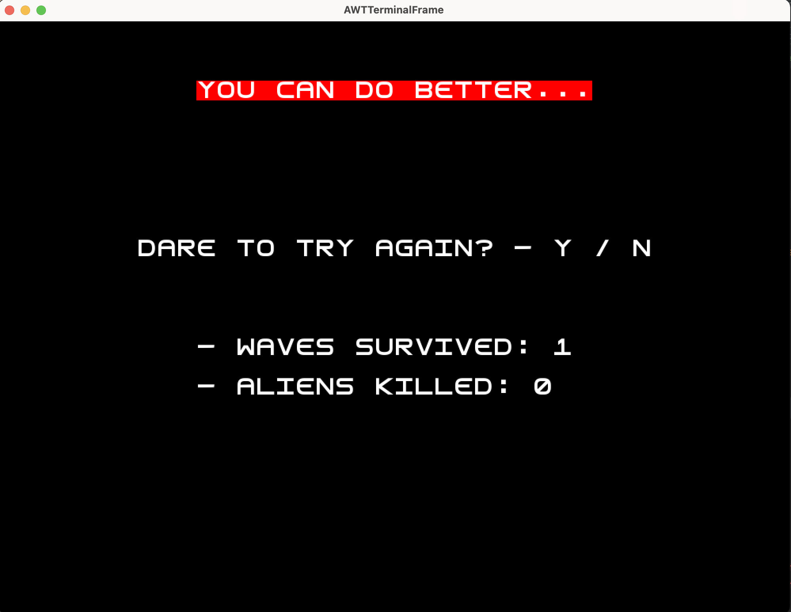
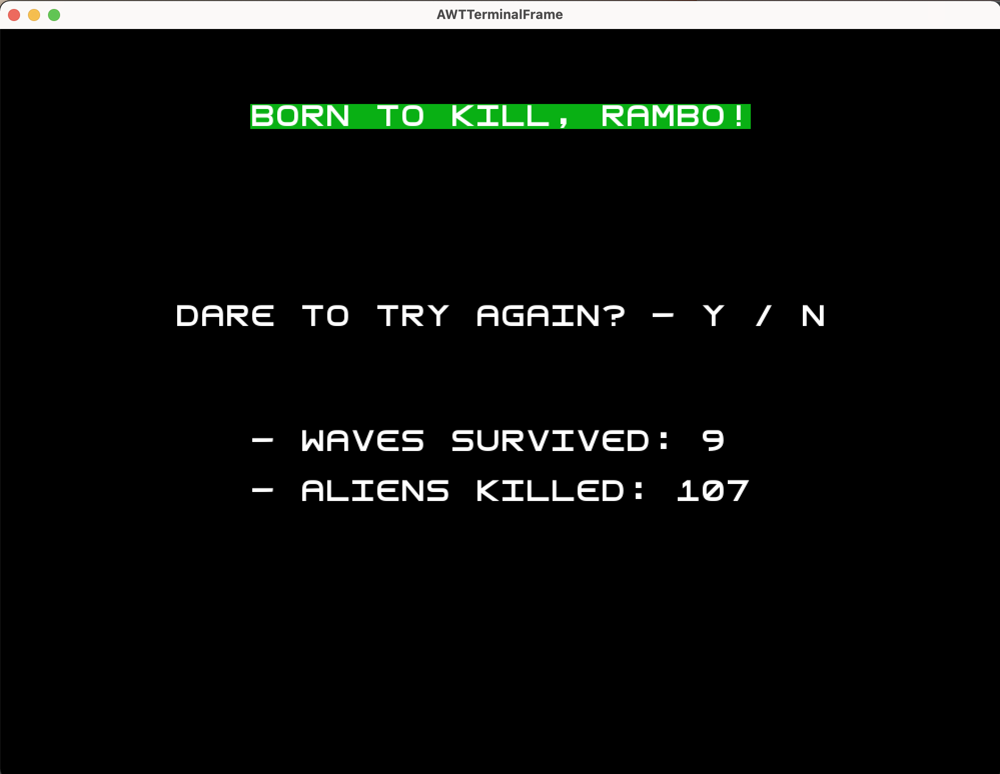
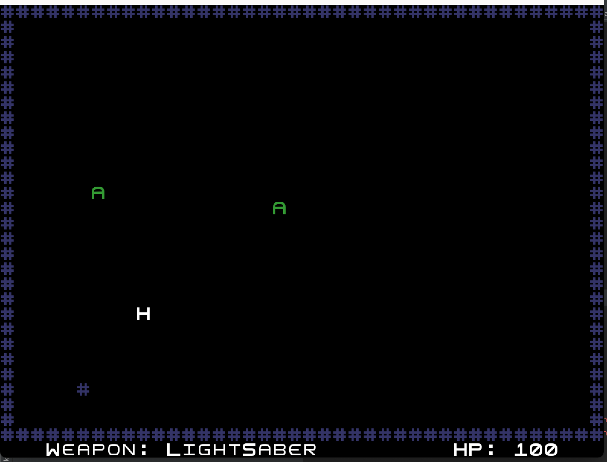
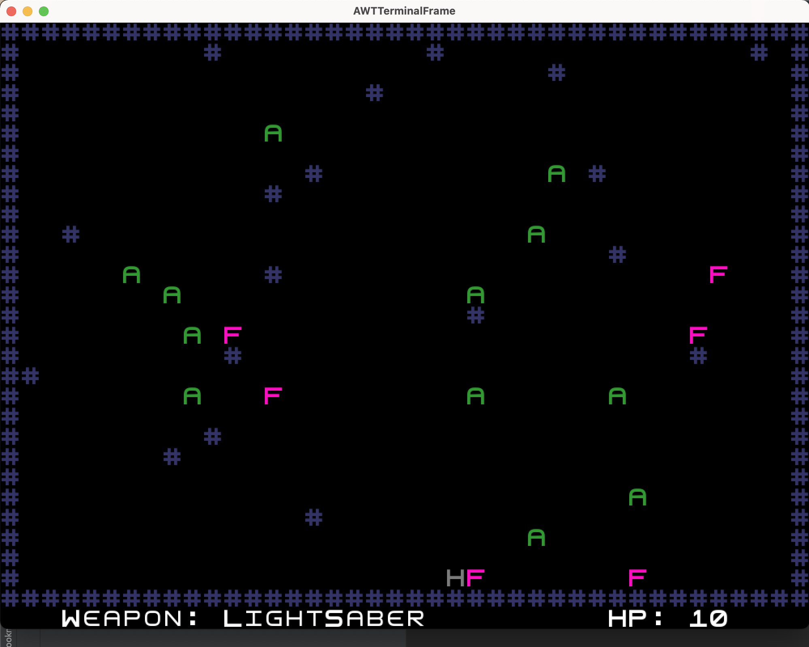
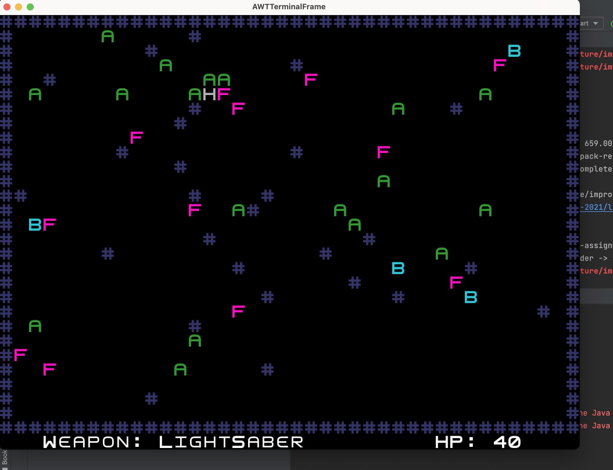

# LDTS - G0603 - Area51

[Project Report](https://github.com/FEUP-LDTS-2021/ldts-project-assignment-g0603/tree/master/docs)

## Game Description

Platform game with a Hero and endless waves of Aliens.

This project was developed by *Bruno Castanheira* (*up202006608*@edu.fc.up.pt), *João Félix* (*up202008867*@up.pt) and *Tiago Loureiro* (*up200706716*@fe.up.pt) for LDTS 2021 / 2022.

## Screenshots

> The following screenshots illustrate the "Menu" parts of our game

### Intro

  

  <b><i>Fig 1. Intro Screenshot</i></b>

### End, Bad Performance

  

  <b><i>Fig 2. Intro Screenshot</i></b>

### End, Good Performance

  

  <b><i>Fig 3. Intro Screenshot</i></b>

> The following screenshots illustrate the "Play" parts of our game

### Initial Wave

  

  <b><i>Fig 4. Initial Wave Screenshot</i></b>

### Middle Wave

  

  <b><i>Fig 5. Middle Wave Screenshot</i></b>

### Advanced Wave

  

  <b><i>Fig 6. Advanced Wave Screenshot</i></b>

