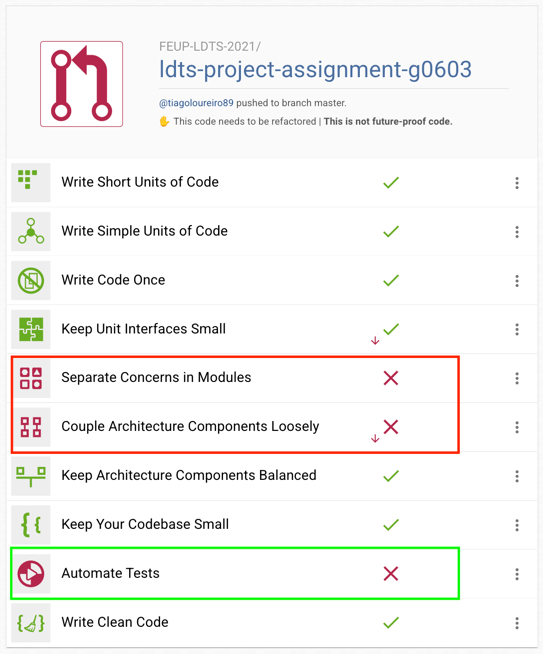
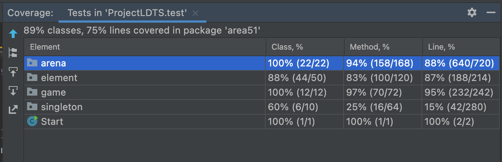

## LDTS_0603 - Area51

Platform game with a Hero and endless waves of Aliens.

This project was developed by *Bruno Castanheira* (*up202006608*@edu.fc.up.pt), *João Félix* (*up202008867*@up.pt) and *Tiago Loureiro* (*up200706716*@fe.up.pt) for LDTS 2021 / 2022.

### IMPLEMENTED FEATURES

- UML
- Classes
- Spocks
- Implementation

- All Features of V0

- V1 Features completed:
    - 3 subclasses of Alien
    - Waves Concept (where more Aliens appear on each wave)
    - Player can leave and restart game (just like restart if player loses)
    - When losing (or leaving), they are informed of last Wave reached and how many Aliens were killed

- V1 Features partially completed:
    - Human can shoot
    - We can use Mouse to control the shooting
    - We add several types of objects (like Rock, Pill, Alien Pod)
    - Game area is expansive and location randomly assigned (but with minimums given)
    - Player can pause the game

### PLANNED FEATURES

V.0 - The Basic:
- Human can move and attack (motorsaw?)
- Alien can move and attack (bite?)
- Screen that renders the game
- Area of the game and Human/Alien initial locations are fixed
- Keyboard to control Human movements
- Life attribute
- Start, middle and end of the Game (victory if Alien life = 0, lose if Human life = 0)

V.1 - The Good:
- Human can shoot
- We can use Mouse to control the shooting
- 3 subclasses of Alien
- Waves Concept (where more Aliens appear on each wave)
- We add several types of objects (like Rock, Pill, Alien Pod)
- Game area is expansive and location randomly assigned (but with minimums given)
- Player can pause the game, leave and restart it (just like restart if player loses)
- When losing (or leaving), they are informed of last Wave reached and how many Aliens were killed

> This version is not expected to be reached, but the Design Patterns should make it easy to expand into.

V.2 - The Great:
- Human has other Humans as allies
- Different kinds of guns (granade, missile, motorsaw, etc.)
- More Alien traits and subclasses (spits acid, regenerate, fly, etc.)
- Alien Spaceship (while a Pod spawns aliens one by one, a Spaceship once landed, would spawn a big amount at once)
- More objects (ammunition, trees, lakes, cliffs, etc.)
- Buildings (that we can use and operate, or leave a Human ally there, etc.)

### DESIGN

Patterns Summary:
- State (Game)
- Builder (ElementBuilder, ElementDirector)
- Singleton (GUI, Cycles)
- Facade (GUI)
- Bridge (Element -> Traits, PlayingState -> Engines, AttackTrait -> Weapons)
- Command (State.run, Engine.execute)
- Observer (KeyboardObserver, KeyboardListener)

### State Pattern
#### Problem in Context
- Game flows in a discrete matter and sometimes in a circular way.
- Having all the Game code in a single file, with a sequence of IFs would generate the Large Class code smell.
#### The Pattern
- Create a "State" interface.
- Create each State in a separate file.
- Game HAS a State and allows to run() it any amount of times needed.
#### Implementation
- See package Game with attention to GameState files.
#### Consequences
- Easy to go back and forth, which allows for Game restarting and the Waves concept.
- Code is much better distributed, easier to read, and protected with private methods and easier tests.

### Builder Pattern
#### Problem in Context
- game.StartingState was getting too big and complex with many private/untestable methods
#### The Pattern
- extract creational code into two separate files, the Director (Recipe) and the Builder (Steps) 
#### Implementation
- See package arena.builder with the ElementsDirector and ElementsBuilder files.
#### Consequences
- Much easier to read and access methods.
- Much better (and) easier testing.
- Allows composing new "recipes" without duplicating code

### Singleton Pattern
#### Problem in Context
- We had code that would always be accessed from "anywhere" like getting keyboard input or drawing to screen.
- We didn't feel that this code belonged to "game" or even that it could be "multiple" instances of it. Like multiple screens or keyboards.
#### The Pattern
- Create a Singleton Object with static method for calling, and a static variable to store a single instance.
#### Implementation
- See package singleton with Gui and Cycle Singletons.
#### Consequences
- Surprisingly, using the injectSingleton (test only) method, it was great for tests. Allowing to mock and listen to calls to these interfaces.
- We never had a problem with duplicated instances, like two terminals, etc.

### Facade Pattern
#### Problem in Context
- We had Lanterna code, concepts and verbose inputs in several places.
- Because it was a library, was easy to have duplicated code (like the same code for Element Drawing)
#### The Pattern
- Create a Facade class that is responsible for "wrapping" all the calls to a certain library. 
- The library should not be imported to any other file.
#### Implementation
- See GuiSingleton as a Facade with LanternaGUI.
#### Consequences
- Simpler, more friendly code on the client side. Like drawString(), drawChar().
- Easier to discover and reuse methods.

### Bridge Pattern
#### Problem in Context
- This was our toughest problem, how to do composition over inheritance.
- Initially we tended towards StrategyPattern, but it required the same exact params every time, but that was not our use case.
- We then realized that "behaviour code" would better be in the engines (with command pattern) and the "state code" stay on the Elements.
- This was more in line with Bridge Pattern, allowing an object to "acquire" another class fields and methods in runtime, like the change of a weapon.
#### The Pattern
- Extract the fields and methods of a certain "domain" to a separate class.
- Allow the original class to access it by having a private field with an instance of that class.
#### Implementation
- See element.Traits (extracted code from Element), also arena.Engines (extracted code from PlayingState), and element.trait.Weapons (extracted code from AttackTrait).
#### Consequences
- Benefit of Single Responsibility Principle by having files focused on a specific domain/problem.
- Re-utilization of code across a hierarchy
- Much easier testing
- In a negative tone, it could lead to excessive pulverization, having a complex feature (like attacking) spread out across several files.

### Command Pattern
#### Problem in Context
- This game had a few, very complex features, like moving or attacking.
- Having them in a single file, like a Game State or a single trait/element, was causing the LargeClass code smell.
- Even the Spock file of that class was getting much of the code lines related to that complex feature.
#### The Pattern
- extract a single, but complex, action to a separate class.
- have only one public way to call it and make it clear through an interface.
- name it according to a specific action/problem.
- move all the spock methods of that feature to a spock of that new separate class.
#### Implementation
- See arena.Engines (.execute command) and GameState (.run command)
#### Consequences
- Better code organization/separation/clarity.
- A single Spock can have all the edge cases of a specific complex problem.
- Helped with TDD :)

## Known Code Smells And Refactoring Suggestions

#### **Large Class**
The files below have too many methods, comments below:
- GuiSingleton, maybe parts of the code code be extracted to separate parts (like GuiFactory, GuiDrawer, GuiKeyboard, etc.)
- Arena, there is a lot of logic related with Positions and Elements, and Arena is centralizing it. Maybe extracting to files similar to PositionsCalculator.

#### **Data Class and Lazy Classes**
- Almost all the Element package classes are Data Class and Lazy Class code smell.
- Nonetheless, they do represent models and in another environment/framework, could well represent DB Models.
- Therefore, wouldn't refactor them.

#### **Alternative classes with different interfaces**
- Especially the Human and Alien element classes, are Alternative Class Interfaces.
- Future work is to create child classes of Human (like Hero, Soldier, Civilian) and of Alien (FastAlien, BossAlien, etc.)
so they control better their construction and these details are abstracted from the ElementsBuilder. 

#### **Feature envy**
- Some classes are "in between" two packages, and unfortunately give rise to some feature envy.
- An example is game.PlayingState that when running, calls arena and constantly alters and checks its state.
- We already extracted most of its code to Engines, but it's still interacting more with Arena rather than Game.
- We could extract some of its behaviour to Arena, but since that file is a Large Class code smell, we kind of preferred to stay as it is.  

### Observer Pattern
#### Problem in Context
- We were "losing" keypresses if on a specific cycle the person was still pressing.
- This in a fast-paced game, was small, but noticeable.
- Important to note, that this was also easy to implement thanks to the example project given by the Professor.
#### The Pattern
- create an Observer, responsible for storing Listeners and attaching to the caller.
- create a Listener, responsible for attaching to a receiver and handling down the events.
- create an interface for the "caller-observer" relationship.
- create an interface for the "receiver-listener" relationship.
#### Implementation
- See package singleton. In there we have KeyboardObserver Class (Interface comes from the AWT Library), KeyboardListener Interface that is implemented in the GuiSingleton.
#### Consequences
- Thanks to threading, we have a smoother and more robust experience when capturing input on the PlayState step.

## Continuous Integration

We used BetterCodeHub to check our merge requests.
### Screenshot of BetterCodeHub report

  

  <b><i>Fig 7. Better Code Hub Screenshot</i></b>

We would like to share the following notes:
- We added components depth: 5, highlighting the division between Singleton, Game, Arena, ELement packages.
- We weren't able to get BetterCodeHub to work well with Spock. It can't see assertions or coverage, thus giving wrongly a Red grade on Automated Tests, when it should have been Green.
- We understand the Separate Concerns and the Decouple Components, and we think the Red grade was a preferred tradeoff over the "Keep Components Balanced". 
- Our game logic flows vertically, Start -> Game -> Arena -> Elements. But we preferred to have them horizontally allowing for easier access and more clear visualization of the big components of the package. 
- We didn't add any special interfaces between them, but tried to keep accesses limited.
- Examples: Singleton does not import any other "Area51" package, Game only accesses Arena (not Element package), Arena only accesses Element Package (not Game package) and so on.

## Testing

### Screenshot of coverage report

  

  <b><i>Fig 8. Code Coverage Screenshot</i></b>

### Link to mutation testing report
[Mutation tests](reports/pitest/202201300702/index.html)

### Property Based Testing
We did not find a good candidate for a Property Based Test, but we used the Spock's Data Method on file PositionsCalculatorTest.

### SELF-EVALUATION

- BC: Classes, Spocks, Fonts, Implementation
- JF: Screen, Spocks, Implementation
- TL: UML, Classes, Spocks, Screen, Implementation, Report

- BC: 20%
- JF: 20%
- TL: 60%